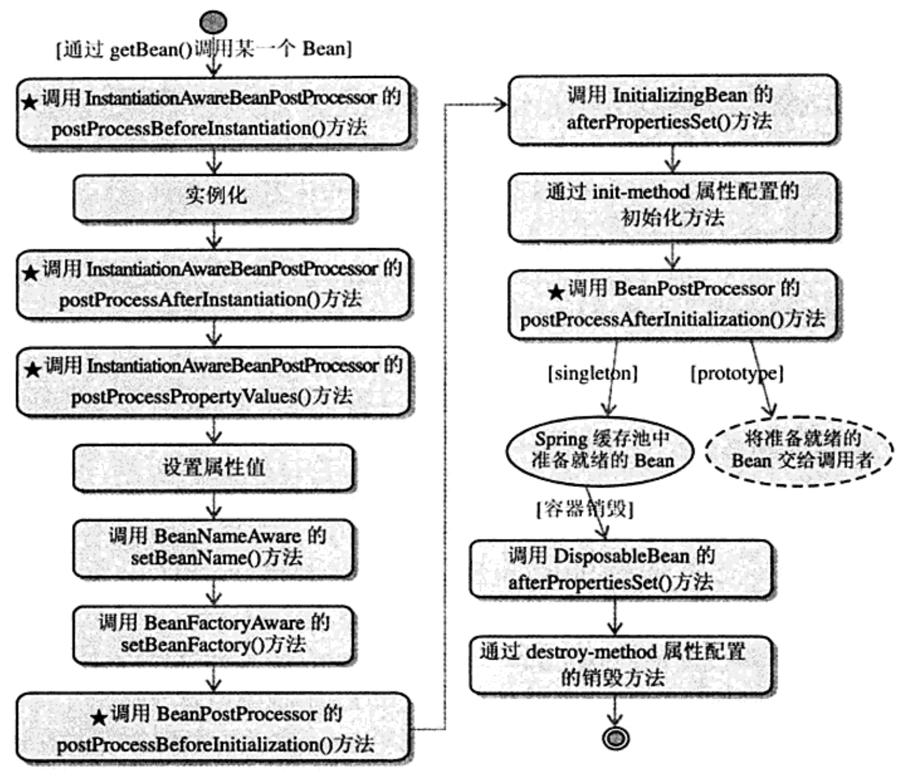

# BeanFactory 的生命周期与源码解析

参考地址：

[《Spring核心之BeanFactory 一张图看懂getBean全过程》](https://blog.csdn.net/zghwaicsdn/article/details/50910384)  
[《Spring bean的生命周期，对比源码详解》](https://blog.csdn.net/a4613934/article/details/79400402)

参考书籍：

**《Spring+3.x企业应用开发实战》**

-----------

前段时间项目中用 EhCache 缓存，其中为某些 Bean 添加缓存的工作放到了 InitializingBean 接口的 afterPropertiesSet() 方法中。对该方法一直都表示很奇怪，BeanFactory 的生命周期部分内容笔者也觉得应该重点学习一下，所以有时间就总结学习一下。  
本文将从一个例程说明 BeanFactory 的生命周期的起始到终结。

# 一. BeanFactory 例程

笔者以 [《Spring源码学习--Bean的生命周期》](https://blog.csdn.net/qq924862077/article/details/75043985) 中的例程为例。笔者也将其上传到笔者的 [github 账号](https://github.com/upcAutoLang/SpringBeanLIfeCycleDemo)上，可以从上面下载并使用 idea 进行实验。  
笔者建议，在 IDE 中建立链接中工程完毕后，<font color=red>**一定要在每一个方法里面打上断点，从 main 方法开始运行并观察程序运行的流程。**</font>

链接中的源码不再赘述。源码运行结果为：

```java
现在开始初始化容器
八月 15, 2018 10:27:00 下午 org.springframework.context.support.ClassPathXmlApplicationContext prepareRefresh
信息: Refreshing org.springframework.context.support.ClassPathXmlApplicationContext@7f560810: startup date [Wed Aug 15 22:27:00 CST 2018]; root of context hierarchy
八月 15, 2018 10:27:00 下午 org.springframework.beans.factory.xml.XmlBeanDefinitionReader loadBeanDefinitions
信息: Loading XML bean definitions from class path resource [beanLife.xml]

这是BeanFactoryPostProcessor实现类构造器！！
BeanFactoryPostProcessor调用postProcessBeanFactory方法
这是BeanPostProcessor实现类构造器！！
这是InstantiationAwareBeanPostProcessorAdapter实现类构造器！！
InstantiationAwareBeanPostProcessor调用postProcessBeforeInstantiation方法
【构造器】调用Person的构造器实例化
InstantiationAwareBeanPostProcessor调用postProcessPropertyValues方法
【注入属性】注入属性address
【注入属性】注入属性name
【注入属性】注入属性phone
【BeanNameAware接口】调用BeanNameAware.setBeanName()
【BeanFactoryAware接口】调用BeanFactoryAware.setBeanFactory()
BeanPostProcessor接口方法postProcessBeforeInitialization对属性进行更改！
【InitializingBean接口】调用InitializingBean.afterPropertiesSet()
【init-method】调用<bean>的init-method属性指定的初始化方法
BeanPostProcessor接口方法postProcessAfterInitialization对属性进行更改！
InstantiationAwareBeanPostProcessor调用postProcessAfterInitialization方法
容器初始化成功
Person [address=广州, name=张三, phone=110]
现在开始关闭容器！
【DiposibleBean接口】调用DiposibleBean.destory()
【destroy-method】调用<bean>的destroy-method属性指定的初始化方法
```

**注：**  
准确的说，<font color=red>**该例程的应用上下文环境是 ApplicationContext**</font>，所以讲的不完全是 BeanFactory 的生命周期。但 ApplicationContext 是 BeanFactory 的派生实现类，且 <font color=red>**ApplicationContext 的生命周期与 BeanFactory 生命周期十分相近**</font>，所以还是用该例程进行说明即可。

# 二. 从例程看 BeanFactory 中 Bean 的生命周期

在《Spring+3.x企业应用开发实战》一书中，用一幅图描述了 BeanFactory 中 Bean 生命周期的完整过程：



笔者用上面的例程调试了一下，发现**<font color=red>输出结果是与上图中的流程不相称的</font>**。所以笔者总结了一下**从 main 方法开始运行到 bean 的销毁整个流程**如下：

## 2.1 ApplicationContext 的初始化


1. main 函数：
	- ApplicationContext factory = new ClassPathXmlApplicationContext("beanLife.xml");

从 main 函数开始，第一句代码定义了一个 classpath 路径为基准的**<font color=red>应用上下文</font>**。也就是说，**<font color=red>定义了 bean 文件的 xml 文件只有放在 web-info/classes 目录下的配置文件才有效果</font>**。  

## 2.2 BeanFactoryPostProcessor

然后代码进入了 AbstractApplicationContext 中。在 ClassPathXmlApplicationContext 中，初始化的核心代码在 **AbstractApplicationContext 的 refresh()** 方法中: 

```java

...
try {
	this.postProcessBeanFactory(beanFactory);
	this.invokeBeanFactoryPostProcessors(beanFactory);
	this.registerBeanPostProcessors(beanFactory);
	this.initMessageSource();
	this.initApplicationEventMulticaster();
	this.onRefresh();
	this.registerListeners();
	this.finishBeanFactoryInitialization(beanFactory);
	this.finishRefresh();
}
...

```

1. AbstractApplicationContext:
	- invokeBeanFactoryPostProcessors(beanFactory): 调用 Bean 工厂后处理器；
2. **AbstractApplicationContext # doGetBean**:
	- beanName = "beanFactoryPostProcessor";
	- 在 invokeBeanFactoryPostProcessors() 方法中载入 id 为 beanFactoryPostProcessor 的 bean，**在 beanLife.xml 中**，该 bean 对应的类为我们自定义的 MyBeanFactoryPostProcessor;
3. 构造函数：MyBeanFactoryPostProcessor;
4. MyBeanFactoryPostProcessor # postProcessBeanFactory:
	- MyBeanFactoryPostProcessor 实现 **BeanFactoryPostProcessor** 接口；
	- BeanDefinition bd = arg0.getBeanDefinition("person"): 
		- （从 beanLife.xml 中）获取名为 person 的 bean 定义；同理如果参数为 "computer"，也可以获取 computer 的 bean 定义；
	- bd.getPropertyValues().addPropertyValue("phone", "110");
		- 获得了 bean 定义后，可以设置属性值；

## 2.3 BeanPostProcessor 与 InstantiationAwareBeanPostProcessor

BeanFactoryPostProcessor 完成后，应用上下文的 refresh() 方法运行至 **registerBeanPostProcessors**，进行 BeanPostProcessor 的初始化：

1. AbstractApplicationContext # registerBeanPostProcessors;
	- 注册 Bean 后处理器；
2. **AbstractApplicationContext # doGetBean**:
	- beanName = "beanPostProcessor";
	- 在 **registerBeanPostProcessors()** 方法中载入 id 为 beanPostProcessor 的 bean，**在 beanLife.xml 中**，该 bean 对应的类为我们自定义的 MyBeanPostProcessor;
3. 构造函数：MyBeanPostProcessor;
4. **AbstractApplicationContext # doGetBean**:
	- beanName = "inistantiationAwareBeanPostProcessor";
	- 在 **registerBeanPostProcessors()** 中，载入 id 为 inistantiationAwareBeanPostProcessor 的 bean，**在 beanLife.xml 中**，该 bean 对应的类为我们自定义的 MyInstantiationAwareBeanPostProcessor;
5. 构造函数：MyInstantiationAwareBeanPostProcessor;
6. AbstractApplicationContext # finishBeanFactoryInitialization();
	- 完成 BeanFactory 的初始化工作；
	- 此后，BeanFactory 冻结所有的 Bean 定义，不再可以修改或者做 post process 操作；

注：关于 AbstractApplicationContext # refresh() 方法详细流程见：[《AbstractApplicationContext.refresh()》](https://blog.csdn.net/andy_zhang2007/article/details/78492438)

## 2.4 xml 文件 bean 的实例化与初始化

截止到上面，应用上下文已经装载完毕，上下文将对 xml 文件中的 bean 中进行实例化。beanLife.xml 配置文件中有 Person 和 Computer 两个 bean，这里以 Person 为例进行说明。

首先是**实例化**，即 Person 构造函数的调用。  

1. MyInstantiationAwareBeanPostProcessor # **postProcessBeforeInstantiation**:
	- 实例化之前的处理；
2. 构造函数：Person;
	- 注意到，即使此时已经调用了 Person 的构造函数，但实际上 main 函数并没有运行到 Person 的 getBean 阶段。说明 **main 函数获取 bean 之前，bean 已经在应用上下文中装载完毕**；

然后是**初始化**，即 Person 属性注入的过程。

1. MyInstantiationAwareBeanPostProcessor # **postProcessPropertyValues**:
	- 为初始化的对象注入属性；
2. Person 注入属性;
	- 分别调用 Person 属性值 name, address, phone 的 set 方法；
3. BeanNameAware # setBeanName
	- Person 实现了 BeanNameAware 接口，则调用该接口方法 setBeanName; 
4. BeanFactoryAware # setBeanFactory
	- Person 实现了 BeanFactoryAware 接口，则调用该接口方法 setBeanFactory;
5. **MyBeanPostProcessor # postProcessBeforeInitialization**:
	- 根据《Spring+3.x 企业应用开发实战》一书中所述：BeanPostProcessor 在 Spring 框架中占有重要的地位，**它为容器提供对 Bean 进行后续加工处理的切入点**，Spring 容器所提供的各种功能（如 AOP，动态代理等），都通过 BeanPostProcessor 实施；
6. InitializingBean # afterPropertiesSet():
	- 初始化方法一；
7. beanLife.xml 的 Person 的 init-method 方法:
	- 初始化方法二；
8. MyBeanPostProcessor # postProcessAfterInitialization:
9. MyInstantiationAwareBeanPostProcessor # postProcessAfterInitialization

经历了上面的**实例化 (Instantiation)** 与**初始化 (Initialization)** 之后，一个 bean 就创建完成了。  
与 person 的 bean 实例化过程相同，剩下一个 id 为 computer 的 bean 实例化与初始化的过程如下：

1. MyInstantiationAwareBeanPostProcessor # postProcessBeforeInstantiation
2. 构造函数：Computer
3. MyInstantiationAwareBeanPostProcessor # postProcessPropertyValues
4. Computer 注入属性;
5. BeanNameAware # setBeanName
6. BeanFactoryAware # setBeanFactory
7. MyBeanPostProcessor # postProcessBeforeInitialization
8. InitializingBean # afterPropertiesSet()
9. beanLife.xml 的 Computer 的 init-method 方法
10. MyBeanPostProcessor # postProcessAfterInitialization
11. MyInstantiationAwareBeanPostProcessor # postProcessAfterInitialization

注：关于两种初始化方法 (afterPropertiesSet 与 init-method 指定方法) 的区别：

> 1. spring为bean提供了两种初始化bean的方式，实现InitializingBean接口，实现afterPropertiesSet方法，或者在配置文件中同过init-method指定，两种方式可以同时使用；
> 2. 实现InitializingBean接口是直接调用afterPropertiesSet方法，比通过反射调用init-method指定的方法效率相对来说要高点。但是init-method方式消除了对spring的依赖；
> 3. 如果调用afterPropertiesSet方法时出错，则不调用init-method指定的方法。

## 2.5 finishRefresh

1. AbstractApplicationContext # finishRefresh
2. 第四次 doGetBean, beanName = "lifecycleProcessor";
3. main # Person person = factory.getBean("person",Person.class);
4. 第五次 doGetBean, beanName = "person";
5. 第六次 doGetBean, beanName = "computer";
6. main # ((ClassPathXmlApplicationContext)factory).registerShutdownHook();
7. 第七次 doGetBean, beanName = "lifecycleProcessor"

## 2.6 main 调用 beans

此后进入 main 函数的 getBean 部分：

```java
public static void main(String[] args) {
	...
	
	//得到Preson，并使用
	Person person = context.getBean("person",Person.class);
	System.out.println(person);
	// 得到 Computer，并使用
	Computer computer = context.getBean("computer", Computer.class);
	System.out.println(computer);
	
	...
}
```

从前面在 BeanPostProcessor 中已经将所有 bean 在应用上下文中实例化完成，在 main 函数这里只是从应用上下文中，通过应用上下文的 getBean 方法取出即可。

## 2.7 bean 的销毁

在基于 web 的 ApplicationContext 实现中，已有相应的实现来处理关闭 web 应用时恰当地关闭 Spring IoC 容器。但对于该例中的一个**非 web 应用的环境**下使用 Spring 的 IoC 容器，如果想让容器优雅的关闭，并调用 singleton 的 bean 相应 destory 回调方法，则需要在 JVM 里注册一个**“关闭钩子” (shutdown hook)**。这一点非常容易做到，并且将会确保你的 **<font color=red>Spring IoC 容器被恰当关闭，以及所有由单例持有的资源都会被释放</font>**。

为了注册“关闭钩子”，你只需要简单地调用在 AbstractApplicationContext 实现中的**registerShutdownHook()** 方法即可。

1. main # registerShutdownHook();
	- main 函数中，AbstractApplicationContext 调用 registerShutdownHook() 方法，注册容器的关闭；
2. Computer 的销毁
	- (1) DisposableBean(Computer) # destory 
	- (2) beanLife.xml 的 Computer 的 destroy-method 方法
3. Person 的销毁
	- (1) DisposableBean(Person) # destory 
	- (2) beanLife.xml 的 Person 的 destroy-method 方法

至此，该程序结束。

# 三. 后记

Spring 生命周期的理解，对后面的事务处理、AOP 等重要特性有很大的帮助。但如果要理解生命周期，单看书是很难理解的，尤其是对着那些又长又多的类名，和它们那些又长又多又像的方法。所以笔者建议如果想要理解声明周期：

<font color=red>**调试！！！**</font>

<font color=red>**调试！！！**</font>

<font color=red>**调试！！！**</font>

只有对着教程，运行代码的一步步调试，才能加深自己的印象。
  
笔者的工程，已经上传到了笔者的 github 账号上。  
路径如下：https://github.com/upcAutoLang/SpringBeanLIfeCycleDemo